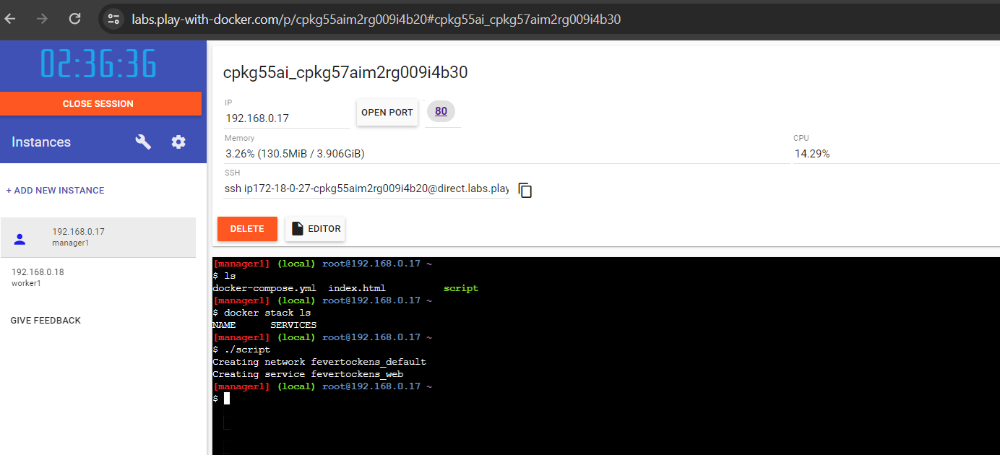
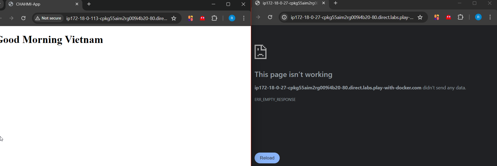
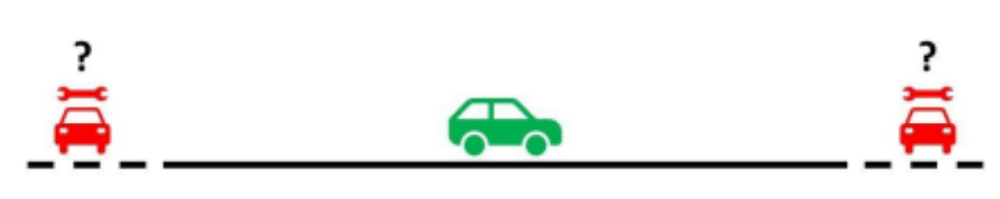

# Task 1


## Purpose of the Repository

This repository is for building an HTML web application and deploying it in a linux friendly Docker Swamp Manager through an SSH based connection using key. Upon modifying the HTML file the workflow gets triggered for updating the service run.

---
---
### How to use

>The only requirement is to define the secrets and variables according to personnal use. In Settings>Secrets and variables>Actions


### Task List

- [x] Image Building
- [x] Image pushing to DockerHub
- [x] File transfering to Docker Swarm 
- [ ] Running the docker compose stack command
- [x] Deploying on Port 80
- [ ] Deploying on Worker node Only

### Steps and approach

Firstly, we try to build and run the web application locally, in which we smoothly succeeded, what follows it to make the workflow file for it and generate a token for the docker authentification.
Secondly, for the deployement in the docker swamp, upon understanding the difficulty of the task we switched to another branch to keep improving the workflow. We understood that we need to transfer the needed files  for the deployement to happen, and so we try using the scp protocol and ssh to to use the deploy command for their known security alas it seemed to have a bug or something when using it with github actions, of course all commands were tried in different servers before applying them into the github actions *(kali linux machine, ubuntu machine, windows 11 machine, git bash terminal)*. We switched to using sftp which worked succesfully, but command execution remained a trouble. 
We stumbled upon a Github repository that renders the SSH connection simpler : https://github.com/appleboy/ssh-action we tried successfully simple commands (`touch file.txt`,`ls`,...) but the docker stack deploy command did not.
And so we could only manually execute the compose file. 
Another issue we encountered was constraining the service to only the worker node, due to lack of precision in the docker docs wo could only try what others suggested on developpers plateformes 
```
placement:
        constraints:
          - node.role == worker
```   
Or draining the worker to prohibit it from hosting the service
```
docker node update --availability drain <NODE-ID>
```
==Though when we waited for long enaugh it did work!==




# Task 2:  Algorithmic

Write a code in two programming languages of your choice that prints the numbers from 1 to 100,
however, for every multiple of ‘3’ it should print “Hello” instead of the number, and for the multiples of
‘5’ it prints “World” and for the multiples of ‘7’ it prints “Yoo”.

==Notice:== 
>Code can be applied for any IDE
>Must have gcc and jdk installed 
>For Java, the file must be named Main.java, if necessary: add package(when using Eclipse for example) 
##### C Language:

```
#include <stdio.h>

int main() {
    for (int i = 1; i <= 99; i++) {
        int space = 0; 
        if (i % 3 == 0) {
            printf("Hello");
            space = 1;
        }
        if (i % 5 == 0) {
            if (space) printf(" ");
            printf("World");
            space = 1;
        }
        if (i % 7 == 0) {
            if (space) printf(" ");
            printf("Yoo");
            space = 1;
        }
        if (!space) {
            printf("%d", i);
        }
        printf(", ");      
    }
    printf("World");
    return 0;
}
```
#### Output:
```
1, 2, Hello, 4, World, Hello, Yoo, 8, Hello, World, 11, Hello, 13, Yoo, Hello World, 16, 17, Hello, 19, World, Hello Yoo, 22, 23, Hello, World, 26, Hello, Yoo, 29, Hello World, 31, 32, Hello, 34, World Yoo, Hello, 37, 38, Hello, World, 41, Hello Yoo, 43, 44, Hello World, 46, 47, Hello, Yoo, World, Hello, 52, 53, Hello, World, Yoo, Hello, 58, 59, Hello World, 61, 62, Hello Yoo, 64, World, Hello, 67, 68, Hello, World Yoo, 71, Hello, 73, 74, Hello World, 76, Yoo, Hello, 79, World, Hello, 82, 83, Hello Yoo, World, 86, Hello, 88, 89, Hello World, Yoo, 92, Hello, 94, World, Hello, 97, Yoo, Hello, World
```
#### Java Language:
```
public class Main {
    public static void main(String[] args) {
        for (int i = 1; i <= 99; i++) {
            int space = 0; 
            if (i % 3 == 0) {
                System.out.print("Hello");
                space = 1;
            }
            if (i % 5 == 0) {
                if (space == 1) System.out.print(" ");
                System.out.print("World");
                space = 1;
            }
            if (i % 7 == 0) {
                if (space == 1) System.out.print(" ");
                System.out.print("Yoo");
                space = 1;
            }
            if (space == 0) {
                System.out.print(i);
            }
            System.out.print(", ");      
        }
        System.out.print("World");
    }
}

```
#### Output:
```
1, 2, Hello, 4, World, Hello, Yoo, 8, Hello, World, 11, Hello, 13, Yoo, Hello World, 16, 17, Hello, 19, World, Hello Yoo, 22, 23, Hello, World, 26, Hello, Yoo, 29, Hello World, 31, 32, Hello, 34, World Yoo, Hello, 37, 38, Hello, World, 41, Hello Yoo, 43, 44, Hello World, 46, 47, Hello, Yoo, World, Hello, 52, 53, Hello, World, Yoo, Hello, 58, 59, Hello World, 61, 62, Hello Yoo, 64, World, Hello, 67, 68, Hello, World Yoo, 71, Hello, 73, 74, Hello World, 76, Yoo, Hello, 79, World, Hello, 82, 83, Hello Yoo, World, 86, Hello, 88, 89, Hello World, Yoo, 92, Hello, 94, World, Hello, 97, Yoo, Hello, World
```

# Task 3:Logic

### Scenario:
You are on the highway in your green car, and your friend contacts you to inform you that his red car has
broken down. The challenge is that neither of you knows which direction he is in.

Assumptions & limitations:
● You can’t leave the highway.
● You can’t call your friend.
● The highway is bidirectional, meaning you can move with your car in any direction you want.
● The highway is infinite, meaning if you move in the same direction, you will never get to an end.
● Your car has infinite gas to run until you find your friend

### Proposition:

If I had a gambling addiction, I would pick one way and commit to it for the chances are 50%, but I thankfully do not have this mental issue :).
After reflexion I found that it's better to have a Zig-Zag  approach, by switching back and forth steadily increasing the distance covered in each way. This is something I got inspired from the Search&Rescue Teams that work on covering surfaces, and expanding the perimeters.
So from the starting point, I'd go 1km in a way then switch back to the other and drive 2kms, then again to the other way driving 4kms. In principal I'd be going double the last distance driven in a way but on the opposite way.